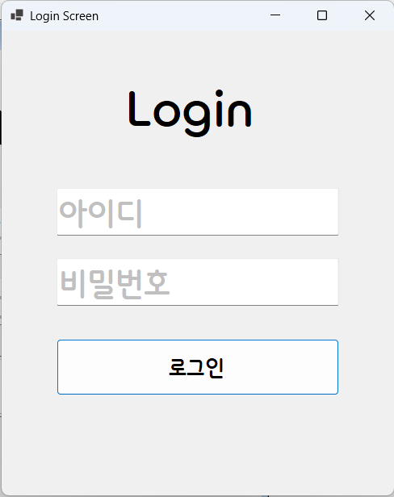
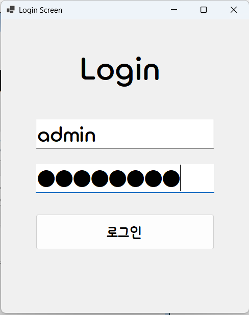
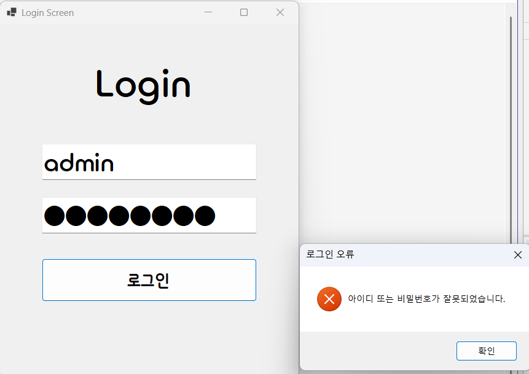
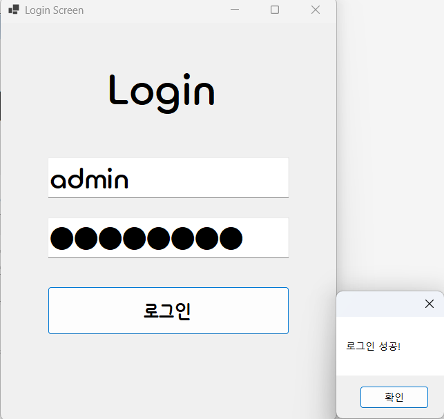

# (C# 코딩) 로그인 화면 (Login Screen)

## 개요
- C# 프로그래밍 학습
- 1줄 소개: 사용자의 아이디와 비밀번호를 입력받아 조건문으로 검사하고, 로그인 성공 여부를 메시지 박스로 알려주는 로그인 화면 프로그램입니다.
- 사용한 플랫폼:
  - C#, .NET Windows Forms, Visual Studio, GitHub
- 사용한 컨트롤:
  - TextBox, Button, Lable
- 사용한 기술과 구현한 기능:
  - Visual Studio 폼 디자이너를 활용하여 로그인 기본 UI를 기획하고 컨트롤을 배치했습니다.
  - Enter와 Leave 이벤트를 활용하여 입력창에 포커스가 갈 때 힌트 텍스트가 사라지고, 벗어나면 다시 생기는 Placeholder(안내 문구) 기능을 구현했습니다.
  - UseSystemPasswordChar 속성을 제어하여 비밀번호 입력 시 화면에 문자가 직접 노출되지 않도록 가림 처리를 적용했습니다.
  - if~else 조건문과 논리 연산자(&&)를 사용하여 입력된 아이디와 비밀번호가 지정된 계정 정보와 일치하는지 비교 검사하는 판단 로직을 구현했습니다.
  - KeyDown 이벤트를 사용하여 Enter 키를 누를 때마다 다음 입력창이나 로그인 버튼으로 자연스럽게 넘어가도록 포커스(Focus) 이동 흐름을 추가했습니다.

## 실행 화면 (과제1)
- 과제1 코드의 실행 스크린샷

- 과제 내용
  - TextBox(아이디, 패스워드), Button(로그인) 등을 폼 화면에 적절히 배치하고 속성을 설정합니다.
  - 아이디와 패스워드 입력 힌트를 회색 글씨로 표시하는 Placeholder 기능을 구현합니다.
  - 아이디와 패스워드가 모두 맞아야 로그인이 허용되는 체크 기능을 구현합니다.
  - 조건 판별 결과에 맞춰 로그인 성공/실패 메시지 박스를 적절하게 보여주도록 구현합니다.

- 구현 내용과 기능 설명
  - 폼 화면 중앙에 아이디(txtID)와 비밀번호(txtPW)를 입력할 TextBox와 로그인을 실행할 btnLogin을 배치하여 인터페이스를 구성했습니다.
  - string.IsNullOrEmpty() 메서드를 활용하여 입력창을 벗어날 때 빈 값인지 검사하고 "아이디", "비밀번호" 힌트 텍스트를 Color.Silver 색상으로 다시 복구하도록 예외 처리를 구현했습니다.
  - 패스워드 창에 포커스가 들어올 때 UseSystemPasswordChar를 true로 설정하여 입력되는 비밀번호 문자가 텍스트 대신 원(●) 형태로 가려지도록 보안 기능을 추가했습니다.
  - KeyDown 이벤트를 활용해 아이디 창에서 Enter를 누르면 비밀번호 창으로 포커스가 이동하고, 비밀번호 창에서 Enter 시 로그인 버튼의 PerformClick()이 호출되도록 키보드 조작 편의성(UX)을 대폭 높였습니다. 시스템 경고음을 막기 위해 SuppressKeyPress = true 처리도 적용했습니다.
  - 로그인 버튼 클릭 시 입력된 아이디가 "admin"이고 비밀번호가 "superman"인지 if문으로 검사하여, 성공 시 "로그인 성공!"을 띄우고, 실패 시 에러 아이콘(MessageBoxIcon.Error)이 포함된 에러 메시지 박스를 띄워 사용자가 직관적으로 결과를 알 수 있게 처리했습니다.